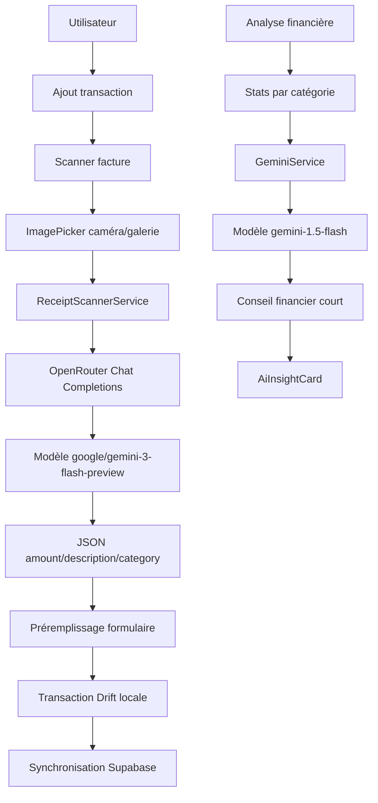

# Système IA de SIKA

## Résumé

La partie IA de SIKA a deux objectifs principaux :

1. Réduire l'effort de saisie des transactions grâce au scan de facture.
2. Aider l'utilisateur à comprendre ses dépenses grâce à un coach financier.

Le code montre deux briques IA distinctes :

- `ReceiptScannerService` : analyse une image de facture/reçu via OpenRouter.
- `GeminiService` : génère un conseil financier personnalisé via Google Gemini.

Il existe aussi des champs et commentaires liés au "Smart Labeling" local, notamment `isAiCategorized` sur les transactions et `keywordsJson` sur les catégories. Cependant, dans le code analysé, la catégorisation automatique locale par mots-clés ou modèle embarqué n'est pas encore clairement implémentée comme moteur autonome.

## Pourquoi intégrer l'IA ?

### 1. Simplifier la saisie

Une application de finances personnelles dépend de la régularité de saisie. Or, entrer manuellement chaque dépense est répétitif. Le scanner de facture répond à ce problème :

- l'utilisateur prend une photo ou choisit une image ;
- l'IA extrait le montant ;
- l'IA génère une description courte ;
- l'IA propose une catégorie compatible avec les catégories existantes ;
- le formulaire de transaction est prérempli.

Le but produit est clair : diminuer la friction et augmenter le nombre de transactions correctement enregistrées.

### 2. Transformer les données en conseils

SIKA ne se limite pas à stocker les dépenses. Le coach IA vise à expliquer les tendances et à proposer une action concrète. Il utilise les statistiques par catégorie pour formuler un conseil court, contextualisé au Gabon et exprimé en FCFA.

### 3. Adapter l'expérience au contexte local

Les prompts et données sont orientés vers :

- le marché africain ;
- le Gabon ;
- la devise FCFA ;
- des conseils directs et actionnables ;
- des catégories de dépenses locales.

## Architecture IA



## Brique 1 : scan de facture

### Fichiers concernés

- `lib/core/services/receipt_scanner_service.dart`
- `lib/features/transactions/presentation/screens/add_transaction_screen.dart`
- `lib/core/constants/api_constants.dart`
- `pubspec.yaml`

### Dépendances utilisées

- `image_picker` pour sélectionner une image depuis la caméra ou la galerie.
- `http` pour appeler OpenRouter.
- `flutter_dotenv` pour charger les clés API.

### Modèle utilisé

Le service utilise OpenRouter avec le modèle :

```text
google/gemini-3-flash-preview
```

L'appel est fait sur :

```text
{OPENROUTER_BASE_URL}/chat/completions
```

Par défaut, `OPENROUTER_BASE_URL` vaut :

```text
https://openrouter.ai/api/v1
```

### Variables d'environnement

Les clés sont lues depuis `.env` via `api_constants.dart` :

```text
OPENROUTER_API_KEY
OPENROUTER_BASE_URL
```

Si `OPENROUTER_BASE_URL` n'est pas défini, l'application utilise l'URL OpenRouter par défaut.

## Parcours utilisateur du scan

Dans `AddTransactionScreen`, l'utilisateur peut appuyer sur l'icône scanner.

Le parcours est :

1. Ouverture d'une bottom sheet "Scanner une facture".
2. Choix entre :
   - prendre une photo ;
   - choisir depuis la galerie.
3. Sélection avec `ImagePicker`.
4. Redimensionnement côté picker :
   - `maxWidth: 1600`
   - `maxHeight: 1600`
   - `imageQuality: 85`
5. Affichage d'un overlay "Analyse en cours".
6. Appel à `ReceiptScannerService.scanReceipt`.
7. Préremplissage du formulaire si l'IA retourne des données.
8. SnackBar de succès ou d'erreur.

## Fonctionnement technique du scan

### Entrées

`ReceiptScannerService.scanReceipt` reçoit :

- `imageFile` : fichier image local ;
- `categoryNames` : liste des catégories disponibles dans l'application.

Les catégories sont récupérées depuis le provider `categoriesProvider`.

### Préparation de l'image

Le service :

1. lit les bytes du fichier ;
2. encode l'image en base64 ;
3. détecte le type MIME selon l'extension :
   - `.png` donne `image/png` ;
   - tout autre cas donne `image/jpeg`.

L'image est ensuite envoyée dans le message sous forme de Data URL :

```text
data:<mimeType>;base64,<base64Image>
```

### Prompt envoyé

Le prompt demande à l'IA d'analyser une facture, un reçu ou un ticket de caisse, puis de retourner uniquement un JSON valide.

Le JSON attendu est :

```json
{
  "amount": 0,
  "description": "description courte",
  "category": "catégorie existante"
}
```

Règles importantes dans le prompt :

- extraire le montant total à payer ;
- ne pas prendre un sous-total ;
- garder seulement le nombre si la devise est FCFA/XAF ;
- produire une description en 5 à 10 mots ;
- choisir exactement une catégorie parmi celles fournies ;
- retourner des valeurs null si l'image n'est pas une facture.

### Paramètres de génération

L'appel OpenRouter utilise :

```text
max_tokens: 500
temperature: 0.1
```

Le choix de `temperature: 0.1` est cohérent avec une tâche d'extraction structurée : on veut limiter la créativité et maximiser la stabilité du JSON.

### Sortie attendue

La sortie est convertie en `ReceiptScanResult` :

- `amount`
- `description`
- `suggestedCategory`

Le résultat est considéré utile si :

```text
amount != null OR description != null
```

### Parsing

Le service nettoie la réponse si elle contient des blocs Markdown :

```text
```json
...
```
```

Puis il parse le JSON avec `jsonDecode`.

Si le parsing échoue, le service retourne un `ReceiptScanResult` vide.

## Préremplissage de transaction

Après un scan réussi, `AddTransactionScreen` utilise le résultat ainsi :

- `amount` remplit le montant ;
- `description` remplit la note ;
- `suggestedCategory` est comparée aux catégories existantes ;
- si une catégorie correspond exactement au nom, son ID est sélectionné ;
- le type de transaction est forcé à `expense`.

Le matching de catégorie se fait par égalité insensible à la casse :

```text
category.name.toLowerCase() == suggestedCategory.toLowerCase()
```

## Limites actuelles du scan

1. Le service dépend d'une connexion internet.
2. Les images sont envoyées à un service externe.
3. Le parsing suppose que la réponse contient un JSON exploitable.
4. Il n'y a pas de timeout HTTP visible.
5. Le type MIME est déduit uniquement de l'extension.
6. Le service logge la réponse IA brute, ce qui peut exposer des données sensibles dans les logs.
7. Le scan ne marque pas la transaction finale comme `isAiCategorized: true`; dans l'ajout manuel, `isAiCategorized` reste à `false`.
8. La correspondance de catégorie exige un nom exact ; une variation mineure peut empêcher la sélection automatique.

## Brique 2 : coach financier IA

### Fichiers concernés

- `lib/features/ai_coach/data/services/gemini_service.dart`
- `lib/features/ai_coach/presentation/widgets/ai_insight_card.dart`
- `lib/features/analytics/domain/entities/category_stat.dart`
- `lib/core/constants/api_constants.dart`

### Dépendance utilisée

Le coach utilise :

```yaml
google_generative_ai: ^0.4.6
```

### Modèle utilisé

Le modèle configuré est :

```text
gemini-1.5-flash
```

### Variable d'environnement

La clé Gemini est lue depuis :

```text
GEMINI_API_KEY
```

Si la variable est absente, `GEMINI_API_KEY` retourne une chaîne vide.

## Fonctionnement du coach IA

### Initialisation

`GeminiService.initialize()` crée un `GenerativeModel` avec :

```text
model: gemini-1.5-flash
temperature: 0.7
maxOutputTokens: 256
```

Le service évite de réinitialiser le modèle si `_isInitialized` vaut déjà `true`.

### Entrées

`analyzeBudget` reçoit :

- `stats` : liste de `CategoryStat`, donc les dépenses groupées par catégorie ;
- `totalIncome` : revenu total optionnel.

Chaque `CategoryStat` contient notamment :

- nom de catégorie ;
- montant total ;
- pourcentage de la catégorie dans les dépenses.

### Données envoyées

Le service transforme les statistiques en pseudo JSON :

```json
[
  {
    "categorie": "Alimentation",
    "montant": 50000,
    "pourcentage": 32.5
  }
]
```

Il calcule aussi :

- total dépenses ;
- revenus, si disponibles.

### Prompt du coach

Le prompt positionne l'IA comme :

- conseiller financier expert ;
- adapté au marché africain, spécifiquement le Gabon ;
- bienveillant, direct et motivant ;
- utilisant le tutoiement ;
- limité à 3 phrases maximum ;
- précis et actionnable ;
- en FCFA ;
- non générique.

### Sortie

La sortie attendue est un texte libre court :

```text
1 conseil précis et actionnable en 3 phrases maximum.
```

Si les statistiques sont vides, le service retourne un message local :

```text
Je n'ai pas assez de données pour t'analyser ce mois-ci. Continue à enregistrer tes transactions !
```

Si l'appel échoue, le service retourne :

```text
Impossible de contacter l'IA pour le moment. Vérifie ta connexion internet.
```

## Interface du coach

`AiInsightCard` est le composant UI prévu pour afficher le coach.

Il gère quatre états :

1. État initial : bouton "Analyser mes dépenses".
2. Chargement : "L'IA analyse tes dépenses...".
3. Erreur : message d'erreur + bouton de relance.
4. Résultat : affichage du conseil dans une carte avec icône ampoule.

Le composant accepte :

- `insight`
- `isLoading`
- `error`
- `onAnalyzePressed`

Point important : dans les recherches de code effectuées, le widget et le service existent, mais leur intégration visible dans l'écran d'analyse n'apparaît pas clairement. La brique semble donc prête côté service/UI, mais possiblement pas encore entièrement branchée dans le parcours principal.

## Données IA en base

### `transactions.isAiCategorized`

La table locale `transactions` contient :

```text
isAiCategorized
```

Ce champ indique si la catégorie a été assignée par l'IA.

Il est aussi synchronisé vers Supabase :

- dans `SyncService` via `is_ai_categorized`;
- dans `AutoSyncService` via `is_ai_categorized`;
- dans la restauration cloud vers local.

Limite observée : dans le flux de scan facture, même si l'IA suggère une catégorie, l'ajout final de transaction met `isAiCategorized` à `false`. Le champ est donc prévu dans le modèle, mais pas encore pleinement utilisé pour ce cas.

### `transactions.validationStatus`

La table `transactions` contient aussi :

```text
validationStatus
```

Ce champ est commenté comme support d'un workflow "Human-in-the-loop" avec notifications actionnables :

- `0` : pending ;
- `1` : validated ;
- `2` : rejected.

Dans l'ajout manuel, les transactions sont enregistrées avec `validationStatus: 1`.

Le code montre donc une intention de validation humaine, mais le flux complet de validation IA n'est pas visible dans les fichiers analysés.

### `categories.keywordsJson`

La table `categories` contient :

```text
keywordsJson
```

Les commentaires indiquent que ce champ est crucial pour du "Smart Labeling" et mentionnent une IA locale TFLite. Les catégories par défaut sont initialisées avec des mots-clés adaptés au contexte local :

- alimentation : boulangerie, supermarché, mbolo, géant, cecado, kiosque ;
- transport : taxi, clando, essence, péage ;
- factures : SEEG, EDAN, Canal, Startimes, loyer ;
- santé : pharmacie, hôpital, clinique ;
- transferts : envoi, réception, retrait, dépôt ;
- loisirs : bar, resto, club, Netflix, cinéma ;
- épargne : objectif, économie, saving.

Limite observée : le moteur local qui exploiterait ces mots-clés pour catégoriser automatiquement n'apparaît pas clairement dans le code lu.

## Sécurité et confidentialité

### Données envoyées aux services IA

Pour le scan de facture, l'application envoie à OpenRouter :

- l'image encodée en base64 ;
- la liste des noms de catégories disponibles ;
- le prompt d'extraction.

Pour le coach financier, l'application envoie à Google Gemini :

- les catégories de dépenses ;
- les montants par catégorie ;
- les pourcentages ;
- le total des dépenses ;
- le total des revenus si fourni.

### Données non envoyées explicitement dans le code observé

Le coach IA n'envoie pas directement :

- le nom de l'utilisateur ;
- l'email ;
- les identifiants de compte ;
- l'historique transactionnel ligne par ligne.

Le scan de facture peut toutefois contenir des données personnelles présentes dans l'image elle-même.

### Points sensibles

1. Les reçus/factures peuvent contenir des noms, numéros, lieux, commerçants ou références.
2. La réponse IA brute est loggée dans `ReceiptScannerService`.
3. Les erreurs OpenRouter peuvent logger le corps de réponse.
4. Il n'y a pas de consentement explicite visible avant l'envoi d'une facture à un service externe.
5. Les clés IA sont chargées depuis `.env`, ce qui est mieux que des constantes en dur, mais une app mobile peut exposer des clés si elles sont embarquées côté client.

## Pourquoi deux fournisseurs IA ?

Le code utilise deux chemins :

- OpenRouter pour l'OCR/analyse visuelle de facture ;
- Google Generative AI SDK pour le coach texte.

Interprétation à partir du code :

- OpenRouter donne accès à un modèle vision/chat compatible avec l'envoi d'image en Data URL.
- Le SDK Google est utilisé directement pour une génération de texte courte à partir de données financières structurées.

Cette séparation fonctionne techniquement, mais elle augmente :

- la surface de configuration ;
- le nombre de clés API ;
- les points de panne ;
- la complexité de monitoring et de coûts.

## Gestion des erreurs

### Scan facture

Cas gérés :

- statut HTTP différent de 200 : exception ;
- erreur de parsing JSON : résultat vide ;
- erreur générale : log + propagation ;
- côté UI : SnackBar d'erreur.

Message utilisateur si aucune donnée n'est extraite :

```text
Impossible de lire cette facture. Essayez avec une photo plus nette.
```

### Coach IA

Cas gérés :

- stats vides : message local encourageant ;
- réponse vide : message d'échec ;
- exception API/réseau : message demandant de vérifier la connexion.

## Forces actuelles

1. Les cas d'usage IA sont utiles et concrets.
2. Le scan facture préremplit directement le formulaire, donc l'IA produit une action immédiate.
3. Les prompts sont localisés : Gabon, FCFA, ton direct.
4. Le prompt OCR force un JSON simple.
5. La température basse du scanner favorise une extraction stable.
6. Le coach limite la sortie à un conseil court et actionnable.
7. Les clés API sont centralisées dans `api_constants.dart` et lues depuis `.env`.

## Limites actuelles

1. Le coach IA semble partiellement implémenté mais pas clairement intégré à l'écran d'analyse.
2. Le champ `isAiCategorized` n'est pas mis à `true` dans le flux de scan facture.
3. Le Smart Labeling local par mots-clés/TFLite est prévu dans les commentaires, mais le moteur n'est pas visible.
4. Les images de factures sont envoyées directement à un fournisseur externe.
5. Les réponses IA brutes sont loggées.
6. Il n'y a pas de schéma JSON strict côté client au-delà du parsing manuel.
7. Il n'y a pas de retry, timeout ou backoff visibles pour les appels IA.
8. Il n'y a pas de cache des conseils IA.
9. Le prompt OCR dépend d'un matching exact des catégories.
10. Les clés IA côté mobile peuvent être exposées si elles sont embarquées dans l'application finale.

## Recommandations

### Produit

1. Ajouter un écran ou une mention claire avant le premier scan : l'image sera analysée par un service IA externe.
2. Brancher explicitement `AiInsightCard` dans l'écran d'analyse si ce n'est pas encore fait.
3. Afficher pourquoi l'IA propose une catégorie : "catégorie suggérée à partir du reçu".
4. Ajouter un bouton permettant de corriger la catégorie et d'améliorer les mots-clés locaux.
5. Ajouter un historique des conseils IA générés.

### Technique

1. Mettre `isAiCategorized` à `true` quand une catégorie est choisie grâce au scan IA.
2. Remplacer le parsing JSON libre par une validation stricte des champs.
3. Ajouter un timeout HTTP pour OpenRouter.
4. Ajouter un retry limité sur erreurs réseau temporaires.
5. Éviter de logger les réponses IA brutes en production.
6. Centraliser les appels IA dans une couche `AiService` ou `AiGateway`.
7. Prévoir une exécution côté backend pour protéger les clés API.
8. Ajouter des tests unitaires sur `_parseResponse`.
9. Ajouter un fallback local par mots-clés si l'IA distante échoue.
10. Normaliser les catégories avec fuzzy matching plutôt qu'égalité exacte.

### Sécurité

1. Ne pas exposer `GEMINI_API_KEY` et `OPENROUTER_API_KEY` dans le client final si possible.
2. Utiliser une Edge Function ou un backend proxy pour signer les requêtes IA.
3. Supprimer ou masquer les informations sensibles dans les logs.
4. Ajouter un consentement utilisateur pour l'envoi d'image.
5. Documenter les données envoyées à chaque fournisseur IA.

## Évolution possible

### Court terme

- Intégrer visiblement le coach IA dans l'analyse.
- Corriger `isAiCategorized`.
- Ajouter timeout/retry.
- Améliorer le matching de catégories.
- Masquer les logs IA sensibles.

### Moyen terme

- Ajouter une catégorisation locale par mots-clés à partir de `keywordsJson`.
- Ajouter un apprentissage simple à partir des corrections utilisateur.
- Stocker les conseils IA générés avec date et période analysée.
- Créer une Edge Function pour les appels IA.

### Long terme

- Construire un vrai coach financier conversationnel.
- Détecter automatiquement les anomalies de dépenses.
- Générer des plans d'économie mensuels.
- Proposer des budgets recommandés par catégorie.
- Mettre en place un modèle hybride : règles locales, IA distante, validation utilisateur.

## Conclusion

L'IA de SIKA est pensée comme une aide pratique, pas comme une couche décorative. Le scan de facture sert à accélérer la saisie, tandis que le coach financier sert à transformer les données en conseil. Le code montre une base solide, surtout pour l'OCR et la génération de conseils courts, mais plusieurs points restent à renforcer : intégration complète du coach, confidentialité, robustesse des appels API, exploitation réelle du champ `isAiCategorized` et mise en place du Smart Labeling local.

